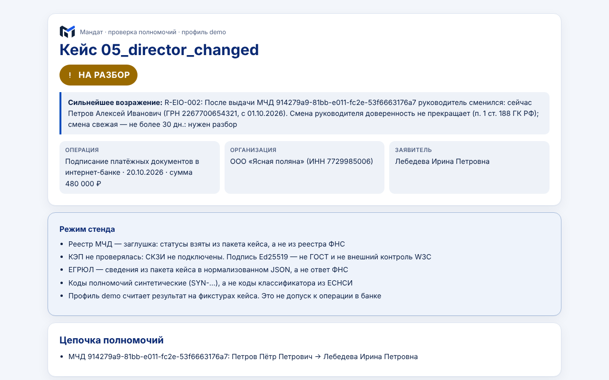

<p align="center">
  
</p>

<p align="center">
  <a href="https://github.com/KonkovDV/Mandat/actions/workflows/ci.yml"></a>
  <a href="https://scorecard.dev/viewer/?uri=github.com/KonkovDV/Mandat"></a>
  
  <a href="LICENSE"></a>
</p>

# Мандат

«Мандат» отвечает банку на вопрос, который сотрудник сегодня решает вручную: может ли этот человек провести эту операцию от имени этой компании в этот день. К ответу приложено, на чём он держится: поле доверенности, запись ЕГРЮЛ, фраза устава и статья закона.

Мы делаем его для трека ВТБ «Финтех без границ», задача «Онбординг и проверка полномочий». Сейчас полуфинал, второй спринт.

[Презентация](submission/slides/Mandat_VTB.pdf) · [видео на две минуты](submission/video/out/Mandat_demo.mp4) · [страница проекта](https://konkovdv.github.io/Mandat/) · [материалы спринта 2](submission/README.md) · [все документы](docs/README.md)

## Зачем

Представитель компании приходит в банк с машиночитаемой доверенностью (МЧД). Сотрудник открывает МЧД, выписку ЕГРЮЛ и устав, сводит их и решает, можно ли допустить человека к операции. Ошибка в сторону «да» дорогая: право подписи получает тот, чьи полномочия уже закончились. По данным Банка России, за первое полугодие 2026 года у юрлиц прошло 1598 операций без согласия на 1,4 млрд рублей. Средняя такая операция во II квартале — около 1,07 млн рублей, и компаниям вернули меньше пятой части (M-07, M-15).

Ошибка в сторону «нет» тоже стоит денег. Смена директора сама по себе доверенность не прекращает (п. 1 ст. 188 ГК РФ), и суд уже обязывал банк провести платёж, в котором тот отказал законному руководителю (M-35). Проверять, что представитель уполномочен, требует и FATF (M-12).

## Как это работает

«Мандат» собирает цепочку полномочий на дату операции: компания, руководитель по ЕГРЮЛ, доверенность в реестре ФНС, передоверие. Цепочку проверяют 39 правил. У каждого есть норма, тест и подсказка сотруднику, что делать дальше. Ответов четыре:

| Ответ | Что он значит |
|---|---|
| ПОДТВЕРЖДЕНО | все обязательные проверки пройдены, возражений нет |
| ОПРОВЕРГНУТО | полномочия нет: доверенность отменена, передоверие запрещено и тому подобное |
| НА РАЗБОР | есть спорное: свежая смена директора, порог в уставе, полномочие записано текстом. Решает человек |
| НЕДОСТАТОЧНО ДАННЫХ | какой-то обязательной проверки не было. Сотрудник видит список того, чего не хватает |

Неизвестное никогда не превращается в «да». Если реестр не ответил, ответ — «недостаточно данных». Если есть сомнение, кейс уходит к человеку, и на карточке видны норма и поле документа.

<p align="center">
  <a href="docs/demo/05_director_changed.html"></a><br>
  <sub>Карточка сотрудника из <code>./run-demo.sh</code>: директор сменился недавно, поэтому кейс идёт на разбор.</sub>
</p>

Каждое решение пишется в журнал, который нельзя незаметно поправить: хеш-цепочка с HMAC и дерево Меркла. Аудитор получает доказательство одной записи без всего журнала (C-09). На решение выпускается подписанное удостоверение со статусом. ДБО, антифрод или другая система банка проверяет его без доступа к базе «Мандата». Если основную доверенность отменили, удостоверения отзываются по всей цепочке, а признаки захвата компании их приостанавливают (C-10, C-11).

Языковая модель подключается по желанию и только приносит факт из устава с дословной цитатой. Вердикт выносят правила ([ADR-001](docs/adr/ADR-001-verdict-ownership.md)), без модели всё работает.

## Захват останавливается до платежа

Самый наглядный сценарий собран в одну команду. Компания проходит проверку и получает удостоверение на один платёж, ДБО спрашивает допуск. Повтор запроса и завышенная сумма получают отказ. Затем приходят смена руководителя, новая МЧД и заявка на смену реквизитов. Это признаки захвата: удостоверения приостанавливаются, и следующий платёж получает отказ до списания денег (C-22). Допуск считает та же функция, что стоит за `POST /v1/operations/authorize`.

```text
$ mandat showcase
«Мандат»: захват компании останавливается до платежа (стенд: данные вымышлены, профиль demo)

1. Проверка кейса 14_old_director_charter_cleared — ПОДТВЕРЖДЕНО
   ООО «Ясная поляна», подписание платежа на 480 000 ₽, 20.10.2026
2. Удостоверение на платёж — ВЫПУЩЕНО
   действует до 19.11.2026 10:00; привязано к организации, дню, операции, сумме, представителю, получателю bank-dbo-msb и одноразовому nonce
3. ДБО: платёж 480 000 ₽ — ДОПУЩЕНО
4. ДБО: повтор того же запроса — ОТКАЗ
   nonce уже использован: повтор запроса
5. ДБО: платёж 1 920 000 ₽ по тому же удостоверению — ОТКАЗ
   сумма 1 920 000 ₽ больше проверенной 480 000 ₽
6. Событие: смена руководителя, новая МЧД и заявка на смену реквизитов — ПРИЗНАКИ ЗАХВАТА
   тревога: possible_takeover; приостановлено удостоверений организации: 2
7. ДБО: следующий платёж по удостоверению, выпущенному до события — ОТКАЗ
   статус удостоверения: приостановлено

Журнал: 7 записей, цепочка цела; включение записи об отказе доказано (дерево Меркла, корень 44a916cff595aa74…)
Сценарий занял 0,05 с.
```

Это стенд: данные вымышлены, события ЕГРЮЛ и МЧД задаёт сценарий. Ключи создаются при каждом запуске, поэтому корень журнала каждый раз свой.

## Запустить демо

Нужен Python 3.11 или новее, подойдут Linux, macOS и WSL:

```bash
./run-demo.sh
```

Скрипт ставит пакет в локальный `.venv`, собирает 14 демо-кейсов в `var/demo/` и в конце показывает `mandat showcase`. Начните с `var/demo/01_ok.html`. На Windows есть `.\run-demo.ps1`.

Без установки можно открыть готовые карточки [01](docs/demo/01_ok.html), [05](docs/demo/05_director_changed.html), [10](docs/demo/10_old_director_poa.html) и [14](docs/demo/14_old_director_charter_cleared.html) или посмотреть [видео](submission/video/out/Mandat_demo.mp4): оно собрано из настоящего вывода команд ([как](submission/video/README.md)). Сценарий показа — в [docs/DEMO.md](docs/DEMO.md), все команды и API — в [docs/RUN.md](docs/RUN.md).

### В Docker

```bash
cp .env.example .env
# в .env: MANDAT_ENV=demo и MANDAT_API_TOKEN=<длинный случайный токен>
docker compose up --build
curl http://127.0.0.1:8000/health
```

Без `MANDAT_ENV` compose не стартует. Для `pilot` и `prod` нужны ещё `MANDAT_JOURNAL_KEY`, `MANDAT_PII_KEY` и `MANDAT_STORE_KEY`: у каждого своё значение длиной от 32 байт ([ключи](docs/KEYS.md)).

Пилотный оверлей кладёт `/app/var` на постоянный том, ставит `MANDAT_ENV=pilot` и проверяет готовность по `/readyz`:

```bash
docker compose -f docker-compose.yml -f deploy/compose.pilot.yml up --build --wait
curl http://127.0.0.1:8000/readyz   # 200, только если журнал, хранилище и ключи в порядке
```

## Что проверено

Числа собирает код в [`evidence.json`](evidence.json). У каждого есть строка в [реестре утверждений](CLAIMS_REGISTRY.md) с командой, которая его воспроизводит.

| № | Что |
|---|---|
| C-01 | 39 правил, у каждого норма, следующий шаг и тест |
| C-02 | 14 демо-кейсов дают ожидаемый вердикт; «подтверждено» только у кейса 14 |
| C-03 | 294 кейса с 49 видами дефектов, вердикт совпал во всех 294 |
| C-03 | ложных «подтверждено» 0 из 288, верхняя граница 95 % — 1,3 % |
| C-05 | без человека решается 38,8 % корпуса, ошибок среди этих решений нет |
| C-06 | на всех 384 цепочках передоверие не шире родительской МЧД, независимая реализация на Cedar даёт те же решения |
| C-17 | 8814 мутаций сценариев: ни одного ложного «подтверждено» и ни одного падения |
| C-13 | 1960 автотестов проходят на Linux и Windows |
| C-14 | проверка кейса занимает меньше 3 мс, 95 % кейсов — быстрее 6 мс |

Корпус синтетический. Он проверяет логику правил, а не точность на документах банка: её покажет пилот.

## Чего пока нет

Это прототип. Все 39 правил в статусе `draft`. Утвердить правило может только юрист банка подписанной записью, строка в файле правил статус не меняет ([ADR-009](docs/adr/ADR-009-rule-approval-records.md)). Реестры на стенде — заглушки за готовыми портами. КЭП не проверяется, пока не подключено СКЗИ банка, и строгий профиль без него «подтверждено» не скажет. Полный список — в [LIMITS.md](LIMITS.md), что дальше — в [дорожной карте](docs/ROADMAP.md).

## Пилот

Проверка, мониторинг, журнал и допуск операции для ДБО уже работают. На пилоте реестр МЧД, ЕФРСБ и СКЗИ банка подключаются к готовым портам, для выписки ЕГРЮЛ порт добавляется по тому же образцу. Ключ подписи удостоверений переезжает в HSM, Vault Transit или AWS KMS.

Предлагаем шесть недель в теневом режиме на одной операции: «Мандат» проверяет те же пакеты, что и сотрудники, но на решения не влияет. Пилот останавливается при первом ложном «подтверждено». От банка нужны владелец процесса, регламент операции, 50–100 обезличенных пакетов, выгрузка классификатора полномочий и юрист, который утвердит правила ([план пилота](docs/PILOT.md)).

В базовом сценарии финансовой модели ручная проверка полномочий стоит около 540 ₽, а затраты банка на «Мандат» — около 64 ₽ на проверку ([экономика](docs/ECONOMICS.md#юнит-экономика-одной-проверки), C-21).

## Задача заказчика

Трек ВТБ ищет продукты, которые можно довести до пилота в банковской среде; онбординг корпоративных клиентов — одно из его направлений. К финалу 11.12.2026 нужен работающий MVP, подтверждённый данными: основной сценарий на работающем решении, бизнес-модель и финансовая модель с затратами, эффектом и сроком окупаемости, план развития и масштабирования ([условия трека](https://fintechacademy.ru/task-1)).

| Условие трека | Как выполнено |
|---|---|
| Российский рынок и регулирование, 152-ФЗ и 115-ФЗ | у каждого правила норма ГК РФ или приказа ФНС о МЧД; персональные данные заменяются метками до модели; идентификацию по 115-ФЗ ведёт банк, «Мандат» её не подменяет |
| Работа on-prem в контуре без открытой сети | ядро не делает внешних запросов (C-12); Docker и пилотный compose с проверкой готовности |
| Генеративные решения — на российских или on-prem моделях | модель включается по желанию: адрес с OpenAI-совместимым API в контуре банка, только хосты из списка `MANDAT_LLM_ALLOWED_HOSTS`; вердикт модель не меняет ([ADR-001](docs/adr/ADR-001-verdict-ownership.md)) |
| Готовность к интеграции с банковскими системами | HTTP API с OpenAPI и ролями; допуск операции для ДБО; порты к реестру МЧД, ЕФРСБ и СКЗИ банка |
| Работающий MVP, подтверждённый данными | демо одной командой, корпус из 294 кейсов и `evidence.json`; данные ВТБ — на [теневом пилоте](docs/PILOT.md) |
| Финансовая модель, окупаемость, план развития | [пакет аналитики](submission/analytics/README.md), [юнит-экономика](docs/ECONOMICS.md#юнит-экономика-одной-проверки), [дорожная карта](docs/ROADMAP.md) |

## Что сделано во втором спринте

- Правило утверждает только подписанная запись юриста с хешем текста правила. Подделанный статус в файле «подтверждено» не даёт (C-20). Для юриста собран [пакет](docs/legal/README.md): карточка нормы на каждое правило.
- ДБО спрашивает допуск по HTTP. `nonce` расходуется атомарно, повтор и откат списка статусов получают отказ (C-18).
- `mandat showcase` показывает весь путь захвата и отказ до платежа (C-22).
- Пакет правил знает сроки законов: 315-ФЗ с 01.09.2027, реструктуризацию долгов юрлица по 253-ФЗ с 27.07.2027 и утрату силы приказов Минцифры № 856 и № 857 с 01.03.2028. `mandat law-calendar` показывает ближайшие даты ([календарь](docs/REGULATORY.md#календарь-изменений)).
- Приказы Минцифры № 857, № 1001 и № 856 прочитаны по официальному опубликованию, на карточках пяти правил — дословные цитаты.
- Защита данных: каждое чтение отчёта с персональными данными пишется в журнал, кейс удаляется по основанию из 152-ФЗ, записи хранилища зашифрованы ([нормы и как они закрыты](docs/DATA_PROTECTION_LAW.md)).
- Полный набор тестов идёт в CI на Linux и Windows, gitleaks проверяет всю историю git, сканеры зависимостей идут и по расписанию.

Критерии спринта и где на них ответ — в [плане сдачи](submission/README.md#критерии-спринта-2), подробности — в [истории изменений](CHANGELOG.md).

## Что видит модель

В модель уходят только строки устава о полномочиях, и перед отправкой их чистят. ФИО людей из кейса заменяются ролью. Незнакомая фамилия после слов вроде «заявлению» или «гражданина» тоже становится меткой. Дату рождения и домашний адрес вырезаем. Паспорт, СНИЛС, ИНН и телефон превращаются в псевдонимы, даже если их записали с пробелами, дефисами или словом «номер»; у СНИЛС и ИНН при этом должно сойтись контрольное число.

Суммы остаются: «сделки свыше 1 000 000 руб.» модель должна видеть, иначе она не процитирует порог. Подробности — в [защите данных](docs/DATA_PROTECTION.md).

## Трудные вопросы

| Вопрос | Ответ |
|---|---|
| Ноль ложных «да» — это точность 100 %? | Нет. Это проверка логики на 288 синтетических кейсах-ловушках: каждый дефект, который корпус принёс с собой, пойман. На потоке банка ту же метрику даст пилот ([оценка](docs/EVALUATION.md)) |
| Почему в демо одно «подтверждено»? | Демо — набор ловушек. Сомнение идёт человеку, а «да» выдаётся только при полном доказательстве, включая устав |
| Реестр ФНС уже показывает статус МЧД. Зачем вы? | Статус реестра — одно правило из 39. Рядом смена руководителя, передоверие, сроки, устав и покрытие конкретной операции ([конкуренты](docs/COMPETITORS.md)) |
| Решение принимает ИИ? | Нет. Вердикт выносят правила, модель только предлагает цитату из устава, и без цитаты факта нет ([риски модели](docs/AI_RISKS.md)) |
| КЭП проверяется? | Порт `SignaturePort` ждёт СКЗИ банка. Пока подпись не подтверждена, строгий профиль «да» не говорит |
| Кто отвечает за правила? | Юрист банка. У каждого правила уже есть норма и список вопросов ([вопросы юристу](docs/LEGAL_REVIEW.md)) |
| Кто отвечает, если «Мандат» скажет «подтверждено»? | Решает банк по своему регламенту. «Мандат» готовит карточку с нормой и полем документа и пишет решение в журнал |
| Смена директора гасит доверенности? | Нет (п. 1 ст. 188 ГК РФ). Давняя смена — сигнал, свежая — повод для разбора ([ADR-002](docs/adr/ADR-002-director-change.md)) |
| Что, если реестр МЧД не ответил? | «Недостаточно данных». Молчание источника не считается хорошей новостью |
| Что, если root на сервере перепишет журнал? | С внешним якорем хеш каждого закрытого сегмента уходит наружу: под метку времени RFC 3161, в Rekor или к приёмнику банка. Переписанная история перестаёт совпадать с опубликованной ([внешний якорь](docs/KEYS.md#внешний-якорь-журнала)) |
| Персональные данные и 152-ФЗ? | Ядро не ходит во внешнюю сеть, в модель уходят только строки устава с метками вместо ФИО и номеров ([нормы и как они закрыты](docs/DATA_PROTECTION_LAW.md)) |

Остальные вопросы и сценарий питча — в [docs/JURY.md](docs/JURY.md).

## С чего начать

| Вы | Что читать |
|---|---|
| Разработчик | [запуск и API](docs/RUN.md), [архитектура](docs/ARCHITECTURE.md), [как вносить изменения](CONTRIBUTING.md) |
| Юрист банка | [пакет для юриста](docs/legal/README.md), [вопросы юристу](docs/LEGAL_REVIEW.md), [правила](docs/RULES.md), [границы](LIMITS.md) |
| Информационная безопасность | [SECURITY.md](SECURITY.md), [модель угроз](docs/THREAT_MODEL.md), [ключи](docs/KEYS.md) |
| Жюри | [для жюри](docs/JURY.md), [сценарий показа](docs/DEMO.md), [реестр утверждений](CLAIMS_REGISTRY.md) |
| Руководитель | [каркас MVP](docs/MVP.md), [пилот](docs/PILOT.md), [экономика](docs/ECONOMICS.md) |

## Стек

- Python 3.11–3.15, образ Docker собран на 3.15. У ядра две зависимости: `defusedxml` разбирает XML без внешних сущностей, `cryptography` подписывает Ed25519.
- Удостоверение собрано по модели W3C VC 2.0, статусы — по Bitstring Status List, каноническая запись JSON — по RFC 8785. Запись и подпись совпадают с векторами eddsa-jcs-2022 и с независимой реализацией RFC 8785 (C-10, C-19).
- Внешний JSON читается строго, по I-JSON (RFC 7493): повтор ключа, NaN и слишком глубокая вложенность — ошибка входа.
- Журнал — хеш-цепочка с HMAC и дерево Меркла по RFC 9162, по настройке с внешним якорем сегментов.
- HTTP API на FastAPI и Uvicorn, хранилище в памяти, SQLite или Redis.
- Cedar в CI — вторая, независимая реализация передоверия.
- CI: ruff, mypy в строгом режиме, pytest с порогом покрытия, pip-audit, Trivy, CodeQL, OpenSSF Scorecard и gitleaks. Для `main` собираются SBOM CycloneDX и подписанное происхождение сборки ([как проверить](SECURITY.md#проверить-пакет)).

Откуда взяты решения и что мы прочитали — в [передовых практиках](docs/SOTA.md) и [литературе](docs/LITERATURE.md).

## Лицензия

MIT, © 2026 Коньков Дмитрий. Организации, ИНН и люди в демо вымышлены.
